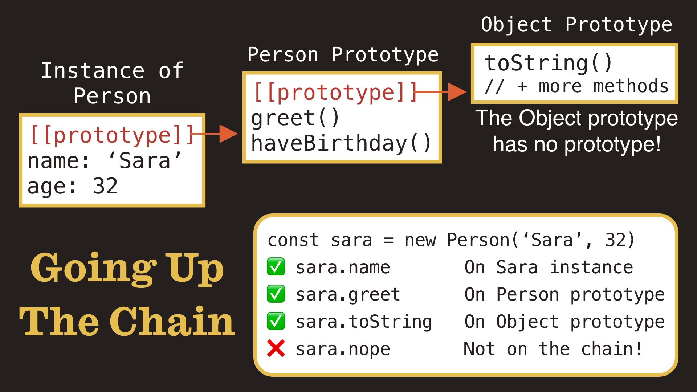
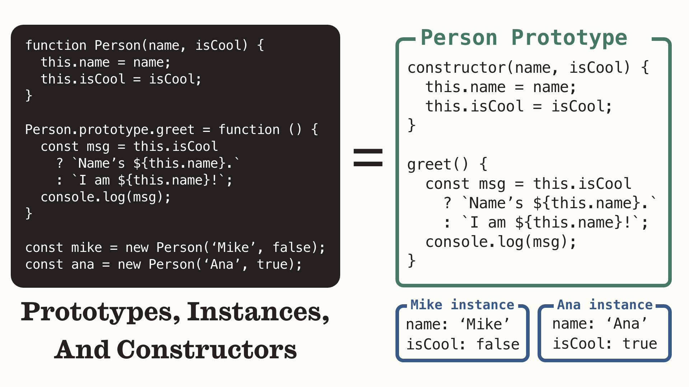
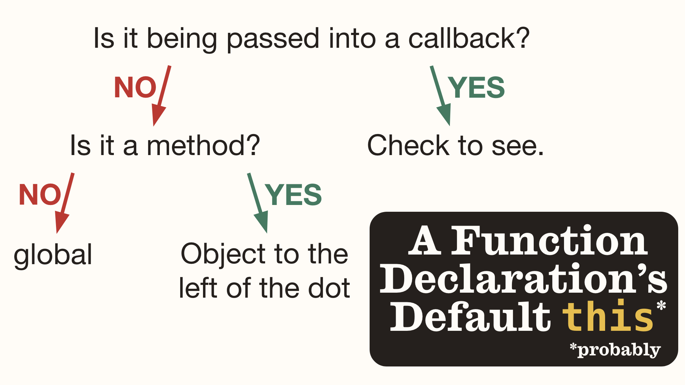
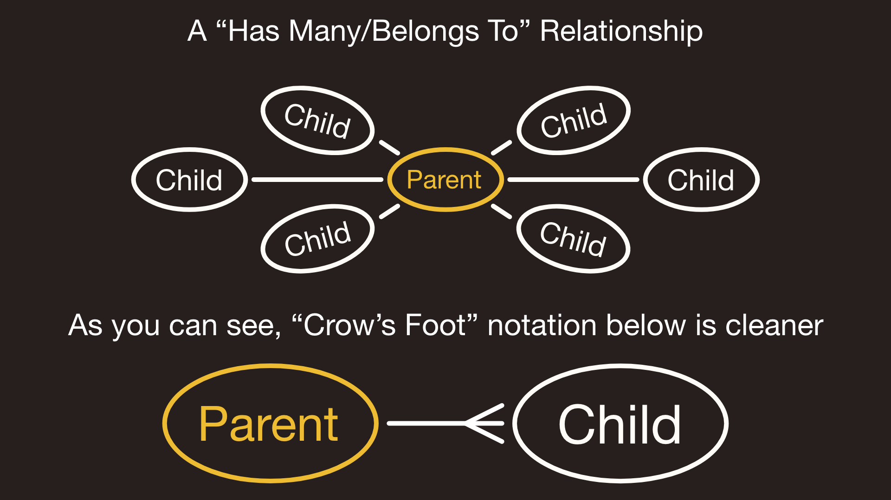
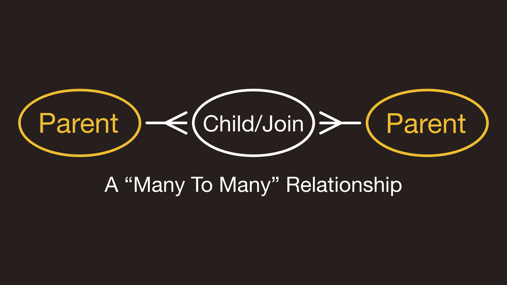
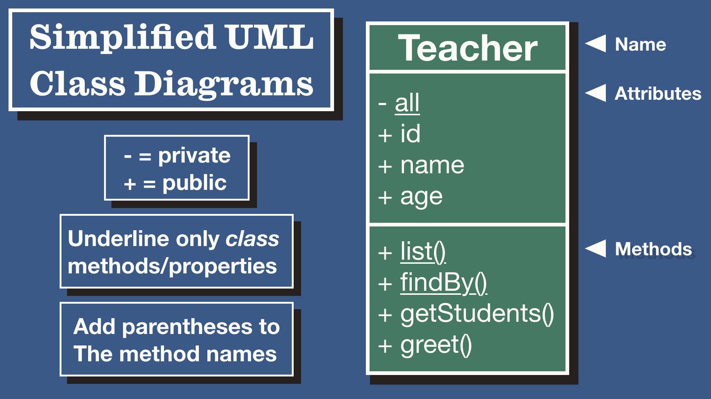
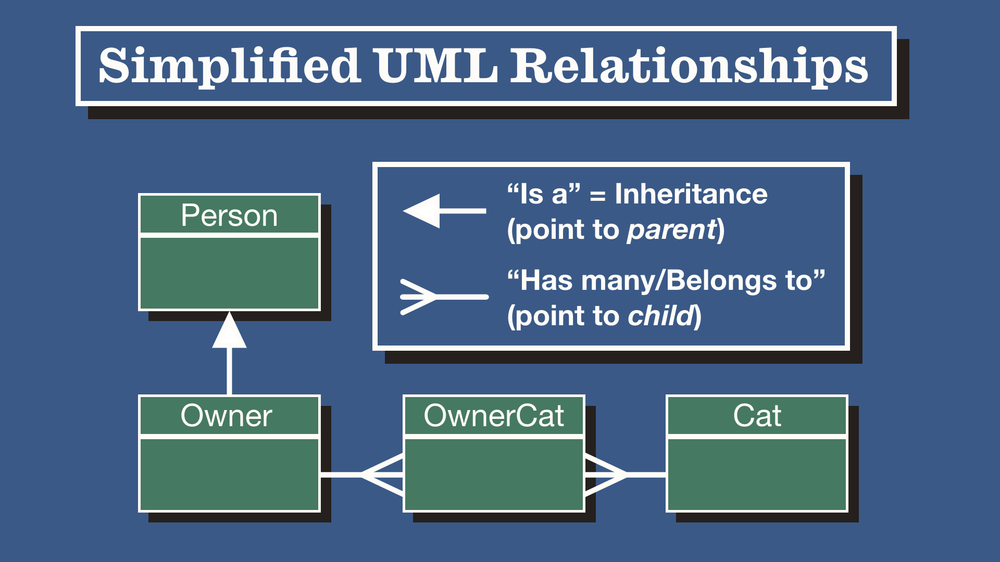

# Unit 4 Study Guide

- [Unit 4 Study Guide](#unit-4-study-guide)
  - [Using this study guide](#using-this-study-guide)
  - [GPT or Google?](#gpt-or-google)
    - [GPT Warnings](#gpt-warnings)
- [Jargon Check!](#jargon-check)
- [Closures](#closures)
  - [A "stereotypical" closure example](#a-stereotypical-closure-example)
  - [A more realistic closure](#a-more-realistic-closure)
- [Factory functions](#factory-functions)
  - [Factory function with closures](#factory-function-with-closures)
  - [Factory functions with `this`](#factory-functions-with-this)
- [Constructors, Classes and Prototypes](#constructors-classes-and-prototypes)
  - [Old School Constructor Syntax](#old-school-constructor-syntax)
  - [New School Class Syntax](#new-school-class-syntax)
    - [Static properties and methods](#static-properties-and-methods)
    - [Can static and instance methods interact?](#can-static-and-instance-methods-interact)
    - [Private properties and methods](#private-properties-and-methods)
- [The weirdness of `this`](#the-weirdness-of-this)
  - [Be wary of callbacks](#be-wary-of-callbacks)
  - [Setting the `this` value](#setting-the-this-value)
  - [Function declarations vs Arrow functions](#function-declarations-vs-arrow-functions)
  - [Setting `this` on instance methods](#setting-this-on-instance-methods)
- [Relationships](#relationships)
  - [Crow's feet and UML](#crows-feet-and-uml)
  - [Inheritance - "Is a"](#inheritance---is-a)
    - [Super](#super)
    - [Polymorphic methods](#polymorphic-methods)
    - [Not enough with inheritance alone](#not-enough-with-inheritance-alone)
  - ["Has many/Belongs to"](#has-manybelongs-to)
    - [How to find relationships?](#how-to-find-relationships)
    - [Who knows who?](#who-knows-who)
    - [What's with the dependency injection?](#whats-with-the-dependency-injection)
  - [Associations - "Many to Many"](#associations---many-to-many)
    - [A final reminder](#a-final-reminder)

## Using this study guide
Unit 4 is almost done, you're so close! But the real test isn't the assessment, it's how well *you* can gauge what you do and don't know. Self study is a critical skill. Our study guides will only guide you, not give you all the answers.

Broken in up into main sections, your task is to review the material, and see what you need to work on. Use this guide to inform your questions during the review lectures. So much of this job is figuring out the *right* questions to ask.

## GPT or Google?
Why not both? If we aren't giving you all the answers here, you have to find them somehow. You know how you talk to your teachers? Where you just keep asking questions, and each question spurs another? Do that with ChatGPT.

Then with each answer, verify the results with an article or code sample from Google. Finally, in your own **digital notes**, write down the questions and their answers in *your* words. Be sure to include links to the articles you found and some code snippets for the code examples so you can reference them later.

### GPT Warnings
As you know GPT just "predicts" what a human would likely respond with to your query. Guess what humans are pretty bad at? `this`. When it comes to understanding `this` take *everything* GPT says with a larger grain of salt than normal. To a lesser extent, GPT tends to be a little iron clad in describing and explaining associations.

Good luck!

# Jargon Check!
Do you know all these common tech terms? You should using them when you communicate:
- Boilerplate
- OOP vs Functional
- Side Effects
- DRY Code
- KISS
- Internal State
- Attributes/Properties
- Method vs Function
- Syntactic Sugar
- Debugging
- Refactoring
- Callbacks
- Iteration
- Argument vs Parameter
- Mutable vs Immutable
- Rubber Duck Debugging
- Pass by Value and Reference
- Instances and Instantiation

And you just learned the "Four Pillars of OOP":
- Encapsulation
- Abstraction
- Inheritance
- Polymorphism

These are just here because you guys are so smart and are already learning advanced concepts:
- Source of Truth
- Dependency Injection
- Isomorphic Code
- IIFE (Immediately Invoked Function Expression)

# Closures

Essential Questions to answer:
- What is a closure?
- How do closures make "private" variables?
- What are some examples of closures we use?
- What is shadow naming?
- What does it mean to encapsulate data?
- How do factory functions abstract complexity?

## A "stereotypical" closure example
When people say "closure" a *lot* of the time they are thinking of a function that declares a local variable, and then returns a function that uses/manipulates that variable in some way.

```js
const makeIdFunction = () => {
  let id = 1;
  return () => {
    id++;
    return id;
  }
}

const getId = makeIdFunction();
console.log(getId())
console.log(getId())
console.log(getId())
console.log(getId())
```
> Check understanding: Can you write a function that continuously adds passed in letters to a string?
>
> ```js
> const makeAddStrFunc = ???
> const addString = makeAddStringFunc('base')
> console.log(addString('!'))
> // base!
> console.log(addString('!'))
> // base!!
> console.log(addString('!'))
> // base!!!
> ```
> Passing in a value is only a change, but not a fundamental one!

## A more realistic closure
However, closure just means a function that references a variable that is in a higher scope and *wasn't* passed in. Most commonly, you'll see them used in conjunction with higher order functions.

```js
const nums = [10, 13, 20, 45, 9, 17];
const logDivisibleBy = (nums, factor) => {
  return nums.forEach(num => {
    if (!(num % factor)) console.log(num)
  })
}

logDivisibleBy(nums, 2);
logDivisibleBy(nums, 3);
logDivisibleBy(nums, 10);
```
> Check understanding: Can you explain why closures are common to use with Higher Order functions?

# Factory functions
Essential questions:
- What is a factory function?
- Why might you use a closure vs `this` to handle state
- Are the objects created by a factory connected at all?

## Factory function with closures
If you need a private variable with your factory function, the way to do that is with a closure. Just be careful with your references!

```js
const privateCarFactory = (make, model, owner) => {
  const owners = [owner];
  return {
    getMake: () => make,
    getModel: () => model,
    getOwners: () => [...owners],
    addOwner: (newOwner) => owners.push(newOwner),
    getProps: () => ({ ...{ make, model, owners } }),
  };
};
```

## Factory functions with `this`
Maintaining internal state with closures is *super* secure, but also a lot of boilerplate. Sometimes you just want to refer to properties in the object, and aren't concerned about privacy. `this` allows us to reference one object property from another.

```js
const thisPersonFactory = (name) => ({
  name,
  isCool: true,
  greet() {
    console.log(`Hi, I'm ${this.name}.`);
  },
  sayCoolness() {
    this.isCool
      ? console.log("I'm one cool customer")
      : console.log("I'm a bit of a dweeb");
  },
});
```

> Check for understanding: What are some of the drawbacks of factory functions?


# Constructors, Classes and Prototypes
Essential Questions:
- What is a constructor function?
- What is the largest difference between classes and factory functions?
- What is the prototype?
- What does the prototype do?

Helpful diagrams:



## Old School Constructor Syntax
Prior to ES2015, we had no choice but to use the prototype and constructor functions directly. Here's an example in the old syntax:

```js
const getId = ((id = 1) => () => id++)();

function Person(name, age) {
  this.id = getId();
  this.name = name;
  this.age = age;
  this.isCool = true;

  Person._all.push(this);
}

Person.prototype.greet = function () {
  console.log(`Hi, I'm ${this.name} and I'm ${this.age}`);
};

Person.prototype.sayCoolness = function () {
  this.isCool
    ? console.log("I'm one cool customer")
    : console.log("I'm a bit of a dweeb");
};

// Here's how static methods work under the hood!
Person._all = []
// no *actual* private values, the _ is a convention that *might* mean "private"

Person.list = () => [...Person._all]

Person.findBy = (searchId) => Person._all.find(({ id }) => id === searchId);

/*
  And here's some code using it!
*/
const tom = new Person('Tom', 24)
tom.greet(); // Hi, I'm Tom and I'm 24
console.log(tom);
// Person { id: 1, name: 'tom', age: 12, isCool: true }
console.log(Person.list())
// [ Person { id: 1, name: 'tom', age: 12, isCool: true } ]


console.log(Person.findBy(tom.id) === tom) // true
console.log(tom instanceof Person) // true

const tomPrototype = Object.getPrototypeOf(tom)
console.log(Object.getOwnPropertyNames(tomPrototype))
// [ 'constructor', 'greet', 'sayCoolness' ]
console.log(tomPrototype === Person.prototype) // true
```

## New School Class Syntax
Now here's how you should *actually* write the above code with class syntax.

```js
const getId = ((id = 1) => () => id++)();

class Person {
  static #all = []; // now we have ACTUAL private variables
  constructor(name, age) {
    this.id = getId();
    this.name = name;
    this.age = age;
    this.isCool = true;

    Person.#all.push(this);
  }

  static list() {
    return [...Person.#all]
  }

  static findBy(searchId) {
    return Person._all.find(({ id }) => id === searchId);
  }

  greet() {
    console.log(`Hi, I'm ${this.name} and I'm ${this.age}`);
  }

  sayCoolness() {
    this.isCool
      ? console.log("I'm one cool customer")
      : console.log("I'm a bit of a dweeb");
  }
};

/*
  And here's some code using it!
  Notice it's EXACTLY the same!
*/
const tom = new Person('Tom', 24)
tom.greet(); // Hi, I'm Tom and I'm 24
console.log(tom);
// Person { id: 1, name: 'tom', age: 12, isCool: true }
console.log(Person.list())
// [ Person { id: 1, name: 'tom', age: 12, isCool: true } ]


console.log(Person.findBy(tom.id) === tom) // true
console.log(tom instanceof Person) // true

const tomPrototype = Object.getPrototypeOf(tom)
console.log(Object.getOwnPropertyNames(tomPrototype))
// [ 'constructor', 'greet', 'sayCoolness' ]
console.log(tomPrototype === Person.prototype) // true
```

Now, while it's true you'll never write the old constructor function way anymore it's important you understand class is really just syntactic sugar on top of it.

### Static properties and methods
Class methods are methods that are called on the class itself, not a new instance. The way we designate these properties and methods is with the `static` keyword.

Remember also, in `static` methods `this` does not refer to an instance! It refers to the class itself. But since we always know the class name, its more common to just write the class name itself when referring to it.

### Can static and instance methods interact?
Yes! You can call static methods inside an instance method simply by calling `ClassName.methodIWant`. And in a class method, if you call `new ClassName()`, that will give you an instance, which you can then call instance methods with.

**Remember, the difference between instance and class methods is just who you call them on.** Class methods are called on the class, instance methods are called on the instance. You can do whatever you want *in* those methods though.

### Private properties and methods
Private properties and methods may not be super common in JS, but they *sure* are in other languages. So it's best you get comfortable with them. In JS, we denote properties and methods as private by prepending them with a `#`.

> Check understanding: Can you design a new class that has static and private methods/properties?


# The weirdness of `this`
Essential questions:
- What is a situation where `this` will behave weirdly?
- How can we lock the `this` to an instance of a class?
- What does `.bind` do vs `.call`?

`this` seems so simple when you first learn it, but there are some truly *odd* pitfalls.

## Be wary of callbacks
When you pass a method as a callback, your method may no longer be "owned" by the object it *should* be called on:

```js
const bob = {
    name: 'Bob',
    greet(otherName) {
      console.log(`Hi ${otherName}, I'm ${this.name}.`);
    },
  };

  bob.greet('Jane');
  // Hi Jane, I'm Bob.

  ['Mr. smith', 'Mrs. Smith'].forEach(bob.greet);
  // Hi Mr. Smith, I'm undefined.
  // Hi Mrs. Smith, I'm undefined.
```

And that's because what actually *calls* the function is no longer the object. It's just a function calling an ownerless callback:

```js
// what's basically happening under the hood of forEach:
const breaker = (callback, ...args) => {
  callback(...args); // WHO'S THE OWNER NOW?
};
```

Remember how we can determine a function declarations' `this`:


## Setting the `this` value
- You can use `.bind`, `.call`, `.apply` to explicitly set the value
  - Do you know the difference between the three?
- Some higher order functions will also let you pass in a `this` argument
- You can also explicitly call the function by passing in an anonymous wrapper function.
  - This may not be ideal, as you are creating a new, anonymous function (this will be important *way* later in React)

```js
function settingThis(...args) {
  console.log("here's the args:", args);
  console.log('this is now:', this);
}

settingThis.call({ a: 1 }, 'Hello!', 'Goodbye!');
settingThis.apply({ b: 2 }, ['Yes please!', 'No thank you!']);

const tim = {
  name: 'Tim',
  greet(otherName) {
    console.log(`Hi ${otherName}, I'm ${this.name}.`);
  },
};

['Mr. Connors', 'Mrs. Connors'].forEach(tim.greet, tim);
// a wrapper function like this isn't super great, but it is an option
['Mr. Connors', 'Mrs. Connors'].forEach((name) => tim.greet(name));

tim.greet = tim.greet.bind(tim);
['Mr. Johnson', 'Mrs. Johnson'].forEach(tim.greet);
```
> Check understanding: Can you literally explain *every* line of that above example? Could you explain them *simply*?

## Function declarations vs Arrow functions
Arrow functions are special and do not use `this` the same way as function declarations. With function declarations the `this` is determined when the function is *called*. With arrows, the `this` is determined lexically at the time of definition, and can't be changed. This makes them handy for enclosing the `this` value from classes for instances.

## Setting `this` on instance methods
Sometimes with our classes, we'll want to lock the this value explicitly. We used to use `.bind`, but now we use arrow functions. We favor arrows now because using `.bind` required us to write the same name like 3 times, which was 2 more chances for typos or other mistakes.

```js
class PersonBind {
  constructor(name) {
    this.name = name;

    this.greet = this.greet.bind(this);
  }

  greet(otherName) {
    console.log(`Hi ${otherName}, I'm ${this.name}`);
  }
}

class PersonArrow {
  constructor(name) {
    this.name = name;
  }

  greet = (otherName) => {
    console.log(`Hi ${otherName}, I'm ${this.name}`);
  };
}
```
Now, be aware this comes at a cost! Locking the method to the instance means that the method will be *redefined* on each instance. This can have memory and other implications (like looping over an object).

```js
const jay = new Person('Jay');
console.log('jay:', jay);

const tom = new PersonArrow('Tom');
console.log('tom:', tom);
```

Only use Arrow functions with classes if you have a good reason to.

> Check understanding: What methods go on the prototype, instance, or class?

# Relationships
Essential questions:
- When should you use inheritance?
- When do you need a "Has many/Belongs to" vs a "Many to Many?"
- Why do we need the Class property .all to use some relationships?
- Why are IDs suddenly so important when using relationships?
- Can you diagram out classes in UML?

Classes don't live in a vacuum, they relate to each other. Being able to explain that is crucial for system design. There are often multiple ways to "model" relationships, always think carefully about the pros and cons.

## Crow's feet and UML
These are two main ways of drawing out technical relationships graphically. Crow's foot is simpler, just circles and lines.

Here's a "Has many/Belongs" to in crow's foot notation


And a "Many to Many"


UML (Unified Modeling Language) allows for much more complexity. It shows more information about the models themselves, *and* their relationships to each other.




## Inheritance - "Is a"
The simplest relationship just means there is a base "Parent" class that extends out to one or more "Child" classes. The relationship is inherently linear.

```js
class Person {
  constructor(name, age) {
    this.name = name;
    this.age = age;
  }

  haveBirthday() {
    this.age++;
    console.log(`I'm ${this.age} years old now!`);
  }

  greet() {
    console.log(`Hi, I'm ${this.name} and I'm ${this.age}`);
  }
}

class Student extends Person {
  constructor(name, age, grade) {
    super(name, age);

    this.grade = grade
  }

  learn(subject) {
    console.log(`I'm learning ${subject}!`)
  }

  // polymorphism - alter parent methods but keep the name the same
  greet() {
    console.log(`Hi, I'm ${this.name} and I'm ${this.age}, and I'm in grade ${this.grade}.`);
  }
}

const jay = new Student('Jay', 18, 12);
console.log('Jay:', jay);
// use existing methods
jay.haveBirthday();

// add new methods
jay.learn('Math');

// polymorphism - alter parent methods
jay.greet();

const bob = new Person('bob', 12)
bob.greet();


console.log('bob instance of Person?', bob instanceof Person);
console.log('jay instance of Person?', jay instanceof Person);
console.log('bob instance of Student?', bob instanceof Student);
console.log('jay instance of Student?', jay instanceof Student);
console.log('jay instance of Object?', jay instanceof Object);
```

### Super
This method *must* be called in the constructor of the children classes. Basically it's like calling `new Parent()`. But be careful! Think about what arguments you need to pass in! You can repeat, omit, alter, or add arguments sent to the parent from the child.

### Polymorphic methods
It literally just means that a child can inherit a method, keep the method name, and then alter it's behavior in some way.

### Not enough with inheritance alone
When a "Parent" class does not really share any traits to the child, but *is* related somehow, you'll need something other than inheritance. That's where association relationships come in.

## "Has many/Belongs to"
When a Parent "Has many" children, but each child "Belongs to" only one parent, it's a "Has many/Belongs to" relationship.

```js
// cat.js
const { getId } = require('./utils');

class Cat {
  static #all = [];

  constructor(name, ownerId, ownerClass) {
    this.id = getId();
    this.name = name;
    this.ownerId = ownerId;
    this.ownerClass = ownerClass;

    Cat.#all.push(this);
  }

  static listByOwner(ownerId) {
    return [...Cat.#all].filter((cat)=> {
      return ownerId === cat.ownerId;
    });
  }

  static create(name, ownerId, ownerClass) {
    return new Cat(name, ownerId, ownerClass);
  }

  owner() {
    return this.ownerClass.list().find((owner) => {
      return owner.id === this.ownerId;
    })
  }
}

module.exports = Cat;

// owner.js
const { getId } = require('./utils');

class Owner {
  static #all = [];

  constructor(name, catClass) {
    this.id = getId();
    this.name = name;
    this.catClass = catClass;

    Owner.#all.push(this);
  }

  static list() {
    return [...Owner.#all];
  }

  static findById(id) {
    return Owner.#all.find(owner => owner.id === id) || null;
  }

  static create(name, catClass) {
    return new Owner(name, catClass);
  }

  cats() {
    return this.catClass.listByOwner(this.id)
  }
}

module.exports = Owner;
```
### How to find relationships?
So above, for an owner to find all their cats, they query the Cat.all array (through a method) and `filter` for any cat that has an ownerId that matches the owners id. On the reverse, each cat can find its owner by querying the Owner.all array (through a method) and `find`s the owner entity who's id matches it's `ownerId`. In order for anyone to find anyone, we must run these queries that rely on ids being unique.

### Who knows who?
A parent and child can't both be expected to save information about the other. Because what if there's a disagreement? In programming, we always try to have a single source of truth. And in this case, it's the child. A child knows about it's parent, and a parent simply asks *all* children if any belong to it. No conflicts can arise about ownership when using this method.

In most cases, that means all entities have a primary id, but the child class stores the parents id as well. Often referred to as the primary key and foreign key. At Marcy, we like the convention that primary keys are just `.id` and foreign are `.parentId` (so `Cat.id, Cat.ownerId, Owner.id` for example). But that is an opinion! Others name both explicitly (`Cat.catId, Cat.ownerId, Owner.ownerId`).

### What's with the dependency injection?
Dependency injection is when we pass in a dependency only when we need it and exactly *where* we need it. If two classes reference each other, you can't just `require` them, that's a circular dependency. So instead we pass the class into the constructor. That gives each instance the class, but no dependency issues!

We use dependency injection when coding these associations, don't forget to include the related classes on instantiation!

> Check understanding: Design your own "Has many/Belongs to" classes. Remember, you can simplify a "Many to Many" (like an Owner has many Cats, each Cat belongs to an owner, even though that isn't always true). It's your program, you decide!

## Associations - "Many to Many"
Relax, we aren't going to ask you to code this one out. But we use a "Many to many" relationship when you could say a `A Parent has many Children` *and* `A Child has many Parents`. In order to facilitate this, we use what's called a "Join." A (sometimes) simple entity that stores the parent id key and links it to another parent id. Sometimes it has a real world entity (like Doctors have many patients *through* appointments), but a lot of the time they don't (Book, BookGenre, Genre).

### A final reminder
Remember, no one writes relationships by only using a class method array! We're using some JS tricks to stand in for Databases (which are where relationships are typically used). Think about the *concepts* more than the syntax when it comes to `Has Many` and `Many to Many`